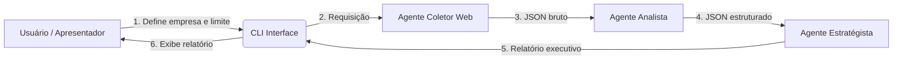

# Arquitetura do Protótipo Multiagentes GenAI

Este documento descreve a arquitetura do protótipo que integra doiss agentes de GenAI para análise de reclamações financeiras. A ideia inicial era fazer um analises e tratamento de reclamações Banco central (BANCEN), tentando reduzir o esforço operacional e melhorar o desempenho na resolução de reclamações. Não tendo os dados das reclmações do BANCEN opotei por recopilar algumas reclamções do site https://www.reclameaqui.com.br/ para alguma enditade financieria. O objetivo é apresentar de forma clara o fluxo de comunicação, os papéis de cada agente e as tecnologias empregadas.

---

## 1. Visão Geral

O sistema é composto por três agentes principais, orquestrados via uma interface de linha de comando (CLI). Cada agente desempenha uma função distinta:

- **Agente Coletor Web**: realiza scraping no site ReclameAqui para obter as reclamações.
- **Agente Analista**: estrutura cada reclamação em JSON, extraindo campos como produto, motivo, sentimento e sugestões.
- **Agente Estratégista**: gera um relatório executivo em português, com insights e recomendações.

A interação com o usuário ocorre em tempo real por meio de parâmetros passados à CLI (`--empresa` e `--limite`) no memento até 10 reclamaçôes.

---

## 2. Diagrama de Arquitetura



1. **Usuário** define na hora o nome da empresa e quantas reclamações deseja analisar.
2. **CLI Interface** recebe os parâmetros e invoca o agente coletor.
3. **Agente Coletor Web** retorna um arquivo JSON com todas as reclamações coletadas.
4. **Agente Analista** processa cada reclamação, gerando um JSON enriquecido.
5. **Agente Estratégista** consome as análises estruturadas e produz um texto resumido.
6. **CLI** apresenta o relatório final ao usuário.

---

## 3. Detalhamento dos Componentes

| Componente              | Descrição                                                                                                                          |
| ----------------------- | ---------------------------------------------------------------------------------------------------------------------------------- |
| **CLI Interface**       | Interface de linha de comando (Python + argparse) que coordena o fluxo entre agentes.                                              |
| **Agente Coletor Web**  | Usa Selenium para fazer scraping no ReclameAqui e gera `reclamacoes_<empresa>.json` com os campos `id`, `titulo`, `texto`, `link`. |
| **Agente Analista**     | Invoca a API OpenAI para analisar cada texto de reclamação e retorna um JSON com:                                                  |
|                         | - `produto`: produto financeiro principal.                                                                                         |
|                         | - `motivo_reclamacao`: categoria do problema.                                                                                      |
|                         | - `sentimento`: análise de sentimento (positivo, negativo, neutro).                                                                |
|                         | - `resumo`: breve síntese do que foi reclamado.                                                                                    |
|                         | - `sugestao_area`: sugestão da área interna mais indicada para tratar o caso.                                                      |
| **Agente Estratégista** | Consolida as análises em um relatório executivo, destacando padrões, pontos críticos e recomendações estratégicas.                 |

---

## 4. Fluxo de Dados

1. O usuário executa:
   ```bash
   python main.py --empresa itau --limite 5
   ```
2. O **Coletor** gera `reclamacoes_itau.json`.
3. O **Analista** lê cada entrada e salva um array de objetos JSON.
4. O **Estratégista** lê esse array e formata um texto final.
5. O texto é renderizado no terminal para apresentação imediata.

---

## 5. Tecnologias Utilizadas

- **Python 3.8+**
- **Selenium** para scraping (ChromeDriver)
- **OpenAI Python SDK** para chamadas de GenAI
- **argparse** para CLI
- **JSON** para troca de dados entre agentes

---

> **
## Como Rodar

### Pré-requisitos
- Python 3.8+
- ChromeDriver instalado e compatível com seu Chrome/Brave.
- Variável de ambiente `OPENAI_API_KEY` configurada.

### no terminal, na pasta dos script, executa cada linha de comandos

python -m venv venv

### para windows:
.\venv\Scripts\activate

pip install requests beautifulsoup4

pip install openai

pip install selenium webdriver-manager

### para windows:
set OPENAI_API_KEY=sua_chave_aqui

python main.py
**
